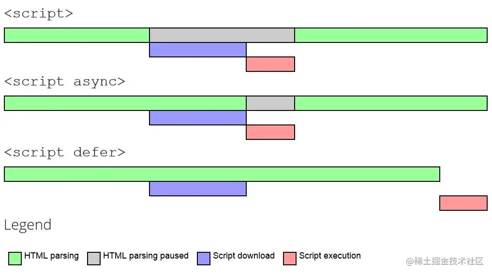
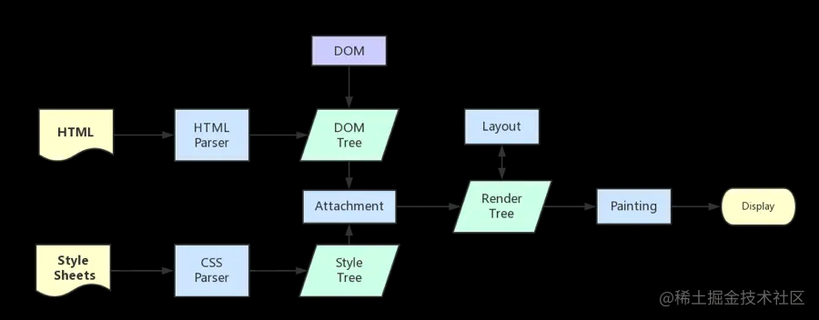

## HTML+CSS
### 1.HTML
#### 1-1.HTML语义化
#### 1-2.script标签中defer和async区别
  

#### 1-3.从浏览器地址栏输入 url 到请求返回发生了什么

  
### 2.CSS
#### 2-1.盒模型
* 标准盒模型 IE盒模型
* `box-sizing: content-box` ：标准盒模型（默认值）。
* `box-sizing: border-box` ：IE（替代）盒模型。
#### 2-2.css选择器优先级
* important>style>id>class
#### 2-3.重排(reflow)和重绘(repaint)
#### 2-4.BFC 块级格式上下文
#### 2-5.两栏布局（左侧固定+右侧自适应布局）
* 1. 利用浮动
* 2. 利用浮动 右侧元素设置`overflow:hidden;` 触发BFC
* 3. 利用flex布局 右侧设置`flex:1`
* 4. 绝对定位

[code](.\前端复习记录.code\2-5两栏布局.html)

#### 2-6.圣杯布局和双飞翼布局（经典三分栏布局）
* 圣杯布局

[圣杯布局](.\前端复习记录.code\2-6圣杯布局.html)
[圣杯布局-felx](.\前端复习记录.code\2-6圣杯布局flex.html)

* 双飞翼布局

双飞翼布局和圣杯布局很类似，不过是在middle的div里又插入一个div，通过调整内部div的margin值，实现中间栏自适应，内容写到内部div中。

[双飞翼布局](.\前端复习记录.code\2-7双飞翼布局.html)
#### 2-7.水平垂直居中多种实现方式

#### 2-8.flex布局
#### 2-9.line-height继承

## JS
## web存储
### 4-1. cookie
### 4-2. localStorage 和 sessionStorage
## Http