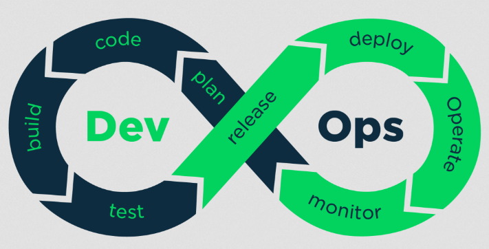

# 笔记

## 阶段一
### 1-2.痛点解析

#### DevOps流程

 

敏捷流程

* 版本控制
* 缺陷控制->文档管理->测试

#### 预防错误的心态

* 如何快速提升
* 入门级学习方法
  * 兴趣是最好的老师（自驱力）
  * 量变引起质变
  * 总结与分享
* 进阶学习
  * 术业要有专攻
  * 对业务、需求的思考
  * 发现自己的不足
* 高阶提升方法
  * 成为多方面的专家
  * 勇于承担与挑战 合理分配时间
  * 参加交流会/技术分享大会

#### 如何选择练手项目

* 系统学习 成体系
* 从临摹开始
* 折腾博客（Hexo，Jekyll，Wordpress）
* 活动日历：Google 微软 AWS TED

#### 自我提升规划

* 浑浑噩噩
* 年龄 性格 天赋
* 迈出第一步
  * 与行业内的人进行交流
  * 了解晋升的途径 设计3-5年的规划
  * 找准实践的机会 做一些东西
* TodoList
* 待办事项 学习提醒
* 加入社区/写博客/组建团队
* 了解学习进度 及时调整 

### 1-3.需求分析

#### 技术栈选择 

* 能够复用，坚决不造轮子；需要造轮子，坚决不牵强

* 怎么简单怎么来，多考虑时间、进度、质量因素

  

  #####  前端

  | 前端响应式   | WebApp    | 小程序 |
  | ------------ | --------- | ------ |
  | LayUI+Vue.js | Mint      | MINA   |
  | Vuex         | Sass/Scss | mpvue  |
  | Vue-router   | iScroll   | ...    |
  | ...          | ...       |        |

  ##### Web服务
  
  Nginx+Https/Caddy
  
  WebSocket
  
  ##### 业务层 服务层 CI/CD流程
  
  koa
  
  iVIew-admin
  
  Nodejs
  
  ##### 存储层
  
  MongoDB Redis
  
  ##### 运行环境
  
  Docker/自定义Dockerfile/私有仓库Harbor

#### 需求分析工具

* 原型类：Axure，Ps，墨刀，蓝湖
* 思维导图：XMind，MindNode（Mac），MindManeger
* 流程图：VIsio（win）/OmniGraffle（Mac）/processOn

​	

### 2.开发环境搭建

| 本地环境 | 测试环境（Linux）    | 数据库服务 |
| -------- | -------------------- | ---------- |
| Node.js  | 虚拟机自建环境       |            |
| IDE      | 购买云服务（>1C+2G） |            |
| Vue-Cli  | 安装Docker           |            |

#### 本地环境

* Node.js（npm/yarn）+nvm（node.js版本管理）
* IDE（Webstorm/VsCode/Atom）
* Vue-Cli
  * 安装命令：`npm install -g @vue/cli`
  * 快速原型开发：`npm install -g @vue/cli-service-global`

#### Linux测试环境

##### Docker
* 拉取镜像`docker pull mongo:4`
* 查看镜像`docker images`
* 运行`docker run -d --name some-mongo -p 10050:27017 mongo:4`
* `docker ps`

##### Robo3T
mongoDb图形化界面

### 2-3.Yarn nvm

### 2-3-6.实机调试

* chrome://inspect/#devices

### 2-4-3 常见的接口测试工具

* 插件类

  * postman 、DHC、REST client

* 平台类

  * Yapi 、DOClever、RAP2、EasyMock、Swagger

* 终端类

  * postman 、SoapUI、DOClever

  